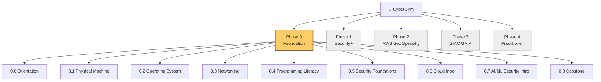

# 📍 Course Map

The whole journey, one page. Use this as your map.

> **Legend:**
> ✅ written and ready to read · 📝 in progress · ⬜ planned · 🧪 hands-on lab

---

## The big picture

> Phase 0 is **active**. Phases 1-4 are **planned** — they'll be designed in detail later.

---

## 🟧 Phase 0 — Foundation (active)

> **Goal:** Kindergarten → masters-level practical understanding across all six topic areas. From "what is a computer" to "I can navigate AWS, read code in three languages, and explain prompt injection."

### Chapter 0.0 — Orientation

> Set up your tools, learn how to read the vault, meet the six topic areas.

- ✅ [[phase-0-foundation/00-orientation/00-welcome|0.0.1 Welcome]]
- ✅ [[phase-0-foundation/00-orientation/01-the-six-topic-areas|0.0.2 The 6 topic areas]]
- ✅ [[phase-0-foundation/00-orientation/02-tools-to-set-up|0.0.3 Tools to set up]]
- ✅ [[phase-0-foundation/00-orientation/03-how-to-take-notes|0.0.4 How to take notes in this vault]]
- ✅ [[phase-0-foundation/00-orientation/04-glossary|0.0.5 Glossary (lives forever)]]

### Chapter 0.1 — Physical Machine

> What a computer actually is. Hardware, boot process, the magic of pressing the power button.

- ✅ [[phase-0-foundation/01-physical-machine/00-what-is-a-computer|0.1.1 What a computer actually is]]
- ✅ [[phase-0-foundation/01-physical-machine/01-bits-and-bytes|0.1.2 Bits and bytes — how machines count]]
- ✅ [[phase-0-foundation/01-physical-machine/02-hexadecimal|0.1.3 Hexadecimal and why hackers love it]]
- ✅ [[phase-0-foundation/01-physical-machine/03-tour-of-a-pc|0.1.4 Tour of a PC tower]]
- ✅ [[phase-0-foundation/01-physical-machine/04-cpu-the-worker|0.1.5 The CPU — the worker]]
- ✅ [[phase-0-foundation/01-physical-machine/05-fetch-decode-execute|0.1.6 How a CPU runs one instruction]]
- ✅ [[phase-0-foundation/01-physical-machine/06-registers-and-cache|0.1.7 Registers and cache]]
- ✅ [[phase-0-foundation/01-physical-machine/07-ram-the-desk|0.1.8 RAM — the desk]]
- ✅ [[phase-0-foundation/01-physical-machine/08-storage|0.1.9 Storage — HDD vs SSD vs NVMe]]
- ✅ [[phase-0-foundation/01-physical-machine/09-motherboard-and-buses|0.1.10 Motherboard, chipset, buses]]
- ✅ [[phase-0-foundation/01-physical-machine/10-gpu|0.1.11 GPU — the artist and the parallel calculator]]
- ✅ [[phase-0-foundation/01-physical-machine/11-power-cooling-case|0.1.12 Power, cooling, the case]]
- ✅ [[phase-0-foundation/01-physical-machine/12-input-output|0.1.13 I/O — keyboard, mouse, USB, monitor]]
- ✅ [[phase-0-foundation/01-physical-machine/13-bios-uefi|0.1.14 BIOS / UEFI — the pre-OS whisper]]
- ✅ [[phase-0-foundation/01-physical-machine/14-boot-sequence|0.1.15 The full boot sequence]]
- 🧪 [[phase-0-foundation/01-physical-machine/15-lab-open-the-box|0.1.L1 Lab — open the box]]

### Chapter 0.2 — Operating System ⬜

> *Skeleton only — full notes coming after Chapter 0.1 is reviewed.*

- ⬜ What software actually is
- ⬜ Compiled vs interpreted
- ⬜ What an OS does (3 jobs)
- ⬜ Kernel vs userland
- ⬜ Processes and threads
- ⬜ Memory management
- ⬜ File systems
- ⬜ Users, groups, permissions
- ⬜ Windows daily-user view
- ⬜ Windows internals 1 — Registry, services, scheduled tasks
- ⬜ Windows internals 2 — Event Viewer, Task Manager (security lens)
- ⬜ Linux — what and why
- ⬜ Linux filesystem hierarchy
- ⬜ Linux users, sudo, permissions
- ⬜ Linux services, systemd, /var/log
- ⬜ macOS quick orientation
- ⬜ The terminal — your real keyboard
- ⬜ Bash basics
- ⬜ PowerShell basics
- 🧪 Lab A — Install Ubuntu in VirtualBox
- 🧪 Lab B — Live in the Linux terminal for a week

📂 [[phase-0-foundation/02-os/index|See chapter index →]]

### Chapter 0.3 — Networking ⬜

> *Skeleton only.*

- ⬜ The postal-system analogy
- ⬜ What a network actually is
- ⬜ IP addresses (v4 / v6)
- ⬜ Subnets and CIDR
- ⬜ MAC addresses and Ethernet
- ⬜ Switches, hubs, routers
- ⬜ The OSI model in 7 layers
- ⬜ TCP vs UDP
- ⬜ Ports and sockets
- ⬜ DNS
- ⬜ DHCP
- ⬜ HTTP
- ⬜ HTTPS and TLS
- ⬜ TLS handshake step by step
- ⬜ Certificates and PKI
- ⬜ Wi-Fi (WPA2 / WPA3)
- ⬜ Firewalls
- ⬜ VPNs
- 🧪 Lab A — Wireshark a TLS handshake
- 🧪 Lab B — `dig`, `nslookup`, `traceroute` real packet journey

📂 [[phase-0-foundation/03-networking/index|See chapter index →]]

### Chapter 0.4 — Programming Literacy ⬜

> *Skeleton only. You don't need to write all these — you need to read them.*

- ⬜ What "code" really is
- ⬜ Compiled vs interpreted (revisited)
- ⬜ Python refresher (security lens)
- ⬜ Bash refresher
- ⬜ PowerShell refresher
- ⬜ Reading C — pointers, memory, why malware lives here
- ⬜ Reading JavaScript
- ⬜ Reading SQL — and where injection happens
- ⬜ Regex literacy
- ⬜ YAML and JSON — the cloud config languages
- ⬜ Reading HTTP requests/responses

📂 [[phase-0-foundation/04-programming-literacy/index|See chapter index →]]

### Chapter 0.5 — Security Foundations ⬜

> *Skeleton only. The heart of Phase 0.*

- ⬜ Why we need security — three breach stories
- ⬜ The CIA triad
- ⬜ Threats, vulnerabilities, exploits, risk
- ⬜ AAA — Authentication, Authorization, Accounting
- ⬜ Defense in depth
- ⬜ Zero trust
- ⬜ Threat actor types
- ⬜ Hashing — one-way math
- ⬜ Symmetric crypto (AES)
- ⬜ Asymmetric crypto (RSA, ECC)
- ⬜ Digital signatures
- ⬜ Certificates and PKI revisited
- ⬜ Common attacks 1 — phishing, social engineering
- ⬜ Common attacks 2 — malware families
- ⬜ Common attacks 3 — MITM, replay, brute force
- ⬜ Web attacks intro — SQLi, XSS, CSRF
- ⬜ MITRE ATT&CK as a map
- ⬜ OWASP Top 10 walkthrough
- 🧪 Lab A — Crack a hash with Hashcat
- 🧪 Lab B — DVWA / PortSwigger Academy basics

📂 [[phase-0-foundation/05-security-foundations/index|See chapter index →]]

### Chapter 0.6 — Cloud, Intro ⬜

> *Skeleton only.*

- ⬜ The cloud demystified
- ⬜ Why companies moved to the cloud
- ⬜ IaaS / PaaS / SaaS
- ⬜ The big 3 — AWS, Azure, GCP
- ⬜ Regions, AZs, edge
- ⬜ Sign up for AWS Free Tier safely
- ⬜ Your first EC2
- ⬜ Your first S3 bucket (and the famous "S3 leak" pattern)
- ⬜ IAM intro
- ⬜ The Shared Responsibility Model
- ⬜ Real cloud horror story (Capital One / Accenture)
- ⬜ Cloud cost discipline

📂 [[phase-0-foundation/06-cloud-intro/index|See chapter index →]]

### Chapter 0.7 — AI/ML Security, Intro ⬜

> *Skeleton only.*

- ⬜ What an ML model actually is — security reframe
- ⬜ Training vs inference attack surface
- ⬜ LLMs from the inside
- ⬜ RAG, agents, fine-tuning vocabulary
- ⬜ Where the AI attack surface lives
- ⬜ Prompt injection — the headline attack
- ⬜ OWASP LLM Top 10 — name and one-liners
- ⬜ Why AI Security is a new field

📂 [[phase-0-foundation/07-ai-ml-security-intro/index|See chapter index →]]

### Chapter 0.8 — Phase 0 Capstone ⬜

- ⬜ Phase 0 review — six topics in one summary
- ⬜ 50-term glossary self-quiz
- 🧪 Capstone — walk through a real (small) breach report and identify which Phase 0 concepts each step involves. Becomes a public blog post in your portfolio.

---

## 🟦 Phase 1 — Security+ (planned)

> *Will be designed in detail after Phase 0 is complete. The same six topic areas, deeper. Capstone: pass CompTIA Security+.*

Topics revisited:
- Machine — processes, memory, registers at the level where buffer overflows make sense
- OS — Windows + Linux internals at defender level
- Networking — comfortable with Wireshark and packet analysis
- Security — full Sec+ syllabus
- Cloud — AWS hands-on basics (EC2, S3, IAM, VPC)
- AI Security — OWASP LLM Top 10 read properly

---

## 🟦 Phase 2 — AWS Security Specialty (planned)

> *The Cloud Security niche. The cert that gets you hired in Sydney.*

Topics revisited:
- Machine — virtualization, hypervisors, containers
- OS — production Linux, container internals (namespaces, cgroups)
- Networking — VPC peering, transit gateway, private endpoints
- Security — SIEM / EDR / IR practitioner
- Cloud — IAM deep dive, KMS, GuardDuty, Security Hub, CloudTrail, network security, secrets, container & K8s security, Essential Eight
- AI Security — hands-on prompt injection lab, adversarial ML reading

---

## 🟦 Phase 3 — GIAC GAIA (planned)

> *The endgame. AI/ML Security expertise.*

Topics revisited:
- Machine — GPU architecture for ML
- OS — ML runtimes, model-serving stacks
- Networking — model APIs and inference traffic
- Security — AI red teaming, threat modelling
- Cloud — securing AI workloads (Bedrock, SageMaker, Azure OpenAI)
- AI Security — full OWASP LLM Top 10 with labs, NIST AI RMF, MITRE ATLAS, hands-on red teaming, adversarial ML, supply chain attacks

---

## 🟦 Phase 4 — Practitioner / Portfolio (ongoing, no cert)

> *No more cert pressure. Real-world projects, blog posts, OSS contributions, conference talks.*

---

*Last updated: 2026-04-30. This map regenerates as each chapter completes.*
