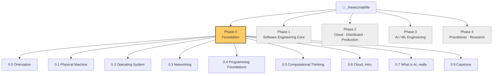

# 📍 Course Map

The whole journey, one page. Use this as your map.

> **Legend:**
> ✅ written and ready to read · 📝 in progress · ⬜ planned · 🧪 hands-on lab

---

## The big picture

> Phase 0 is **active**. Phases 1–4 are **planned** — they'll be designed in detail later.
> The spiral is *flexible*: not every topic appears in every phase. Topics show up where they belong.

---

## 🟧 Phase 0 — Foundation (active)

> **Goal:** Kindergarten → working baseline across the bones of computing. From "what is a computer" to "I can navigate Linux, write small Python programs, deploy a cloud VM, and explain what an LLM actually does."

### Chapter 0.0 — Orientation

> Set up your tools, learn how to read the vault, meet the topic areas.

- ✅ [[phase-0-foundation/00-orientation/00-welcome|0.0.1 Welcome]]
- ✅ [[phase-0-foundation/00-orientation/01-the-six-topic-areas|0.0.2 The 6 topic areas]]
- ✅ [[phase-0-foundation/00-orientation/02-tools-to-set-up|0.0.3 Tools to set up]]
- ✅ [[phase-0-foundation/00-orientation/03-how-to-take-notes|0.0.4 How to take notes in this vault]]
- ✅ [[phase-0-foundation/00-orientation/04-glossary|0.0.5 Glossary (lives forever)]]

### Chapter 0.1 — Physical Machine

> What a computer actually is. Hardware, boot process, the magic of pressing the power button.

- ✅ [[phase-0-foundation/01-physical-machine/00-what-is-a-computer|0.1.1 What a computer actually is]]
- ✅ [[phase-0-foundation/01-physical-machine/01-bits-and-bytes|0.1.2 Bits and bytes — how machines count]]
- ✅ [[phase-0-foundation/01-physical-machine/02-hexadecimal|0.1.3 Hexadecimal and why engineers love it]]
- ✅ [[phase-0-foundation/01-physical-machine/03-tour-of-a-pc|0.1.4 Tour of a PC tower]]
- ✅ [[phase-0-foundation/01-physical-machine/04-cpu-the-worker|0.1.5 The CPU — the worker]]
- ✅ [[phase-0-foundation/01-physical-machine/05-fetch-decode-execute|0.1.6 How a CPU runs one instruction]]
- ✅ [[phase-0-foundation/01-physical-machine/06-registers-and-cache|0.1.7 Registers and cache]]
- ✅ [[phase-0-foundation/01-physical-machine/07-ram-the-desk|0.1.8 RAM — the desk]]
- ✅ [[phase-0-foundation/01-physical-machine/08-storage|0.1.9 Storage — HDD vs SSD vs NVMe]]
- ✅ [[phase-0-foundation/01-physical-machine/09-motherboard-and-buses|0.1.10 Motherboard, chipset, buses]]
- ✅ [[phase-0-foundation/01-physical-machine/10-gpu|0.1.11 GPU — the artist and the parallel calculator]]
- ✅ [[phase-0-foundation/01-physical-machine/11-power-cooling-case|0.1.12 Power, cooling, the case]]
- ✅ [[phase-0-foundation/01-physical-machine/12-input-output|0.1.13 I/O — keyboard, mouse, USB, monitor]]
- ✅ [[phase-0-foundation/01-physical-machine/13-bios-uefi|0.1.14 BIOS / UEFI — the pre-OS whisper]]
- ✅ [[phase-0-foundation/01-physical-machine/14-boot-sequence|0.1.15 The full boot sequence]]
- 🧪 [[phase-0-foundation/01-physical-machine/15-lab-open-the-box|0.1.L1 Lab — open the box]]

### Chapter 0.2 — Operating System ⬜

> *Skeleton only — full notes coming after Chapter 0.1 is reviewed.*

- ⬜ What software actually is
- ⬜ Compiled vs interpreted
- ⬜ What an OS does (3 jobs)
- ⬜ Kernel vs userland
- ⬜ Processes and threads
- ⬜ Memory management
- ⬜ File systems
- ⬜ Users, groups, permissions
- ⬜ Windows daily-user view
- ⬜ Windows internals 1 — Registry, services, scheduled tasks
- ⬜ Windows internals 2 — Event Viewer, Task Manager (engineer's lens)
- ⬜ Linux — what and why
- ⬜ Linux filesystem hierarchy
- ⬜ Linux users, sudo, permissions
- ⬜ Linux services, systemd, /var/log
- ⬜ macOS quick orientation
- ⬜ The terminal — your real keyboard
- ⬜ Bash basics
- ⬜ PowerShell basics
- 🧪 Lab A — Install Ubuntu in VirtualBox
- 🧪 Lab B — Live in the Linux terminal for a week

📂 [[phase-0-foundation/02-os/index|See chapter index →]]

### Chapter 0.3 — Networking ⬜

> *Skeleton only.*

- ⬜ The postal-system analogy
- ⬜ What a network actually is
- ⬜ IP addresses (v4 / v6)
- ⬜ Subnets and CIDR
- ⬜ MAC addresses and Ethernet
- ⬜ Switches, hubs, routers
- ⬜ The OSI model in 7 layers
- ⬜ TCP vs UDP
- ⬜ Ports and sockets
- ⬜ DNS
- ⬜ DHCP
- ⬜ HTTP
- ⬜ HTTPS and TLS
- ⬜ TLS handshake step by step
- ⬜ Certificates and PKI
- ⬜ Wi-Fi (WPA2 / WPA3)
- ⬜ Firewalls
- ⬜ VPNs
- 🧪 Lab A — Wireshark a TLS handshake
- 🧪 Lab B — `dig`, `nslookup`, `traceroute` real packet journey

📂 [[phase-0-foundation/03-networking/index|See chapter index →]]

### Chapter 0.4 — Programming Foundations ⬜

> *Skeleton only. One language deep, then literacy across more.*

- ⬜ What "code" really is
- ⬜ Compiled vs interpreted (revisited)
- ⬜ Python — variables, types, control flow
- ⬜ Python — functions, modules, packages
- ⬜ Python — file I/O, error handling
- ⬜ Python — OOP basics
- ⬜ Reading JavaScript / TypeScript
- ⬜ Reading C — pointers, memory, why low-level still matters
- ⬜ Reading SQL — and why every engineer needs this
- ⬜ Bash and shell scripting
- ⬜ Regex literacy
- ⬜ YAML and JSON — the config languages
- ⬜ Reading HTTP requests/responses

📂 [[phase-0-foundation/04-programming-foundations/index|See chapter index →]]

### Chapter 0.5 — Computational Thinking ⬜

> *Skeleton only. The thinking moves under all the syntax.*

- ⬜ Problem decomposition — splitting a hard thing into smaller things
- ⬜ Algorithms intro — what a recipe really is
- ⬜ Time and space complexity in plain English
- ⬜ Arrays and lists
- ⬜ Dictionaries / hash maps — the unsung hero
- ⬜ Trees and graphs as ideas
- ⬜ Recursion — the mind-bender
- ⬜ Search and sort intuitions
- ⬜ Mental models for debugging
- ⬜ When to write code vs use a tool

📂 [[phase-0-foundation/05-computational-thinking/index|See chapter index →]]

### Chapter 0.6 — Cloud, Intro ⬜

> *Skeleton only.*

- ⬜ The cloud demystified
- ⬜ Why companies moved to the cloud
- ⬜ IaaS / PaaS / SaaS
- ⬜ The big 3 — AWS, Azure, GCP
- ⬜ Regions, AZs, edge
- ⬜ Sign up for AWS Free Tier safely
- ⬜ Your first EC2
- ⬜ Your first S3 bucket
- ⬜ IAM intro
- ⬜ The Shared Responsibility Model
- ⬜ What "serverless" really means
- ⬜ Cloud cost discipline

📂 [[phase-0-foundation/06-cloud-intro/index|See chapter index →]]

### Chapter 0.7 — What is AI, really ⬜

> *Skeleton only. AI literacy at Phase 0, before going deep in Phase 3.*

- ⬜ What "AI" actually means today
- ⬜ ML in one diagram — train, predict, evaluate
- ⬜ Supervised vs unsupervised vs reinforcement
- ⬜ Neural networks — the cartoon version
- ⬜ What a transformer is, in plain English
- ⬜ LLMs from the outside — what they're good and bad at
- ⬜ Prompts, tokens, context windows
- ⬜ RAG, agents, fine-tuning — the vocabulary
- ⬜ Using AI as a coding partner (Cursor / Claude / Copilot, properly)
- ⬜ The honest limits of LLMs

📂 [[phase-0-foundation/07-what-is-ai/index|See chapter index →]]

### Chapter 0.8 — Phase 0 Capstone ⬜

- ⬜ Phase 0 review — the bones of computing in one summary
- ⬜ 50-term glossary self-quiz
- 🧪 Capstone — build one small project end to end: a Python CLI tool, deployed on a free-tier EC2, with one feature that calls an LLM API. Becomes the first portfolio piece.

---

## 🟦 Phase 1 — Software Engineering Core (planned)

> *The trunk of the tree. Real engineer-level chops.*

Likely topic threads:
- **Languages** — Python deep, then a second language with serious depth (TypeScript or Go)
- **Data structures + algorithms** — the engineer's version, not the LeetCode-grind version
- **System design** — fundamentals; the YouTube-tier system design questions, then the real-world ones
- **Git + collaboration** — branching strategies, code review, conflict resolution
- **Testing + debugging** — unit, integration, end-to-end, observability mindset
- **Web fundamentals** — HTTP deep, REST, GraphQL, browsers, frontend basics
- **Databases** — SQL deep, NoSQL intro, when to pick which
- **AI as a coding partner** — using LLMs like a senior engineer does

---

## 🟦 Phase 2 — Cloud · Distributed · Production (planned)

> *Where modern software actually lives. Cert target: AWS Solutions Architect Associate.*

Likely topic threads:
- **Cloud (AWS heavy)** — EC2, S3, IAM, VPC, Lambda, RDS, the core forty services
- **Containers** — Docker thoroughly, Kubernetes practically
- **CI/CD + DevOps** — GitHub Actions, Terraform / IaC, deploy pipelines
- **Distributed systems** — consistency, availability, partitions; queues, pub/sub, caches
- **Microservices vs monoliths** — when each makes sense
- **Performance + scalability** — load testing, profiling, capacity planning
- **Observability** — logs, metrics, traces, the three pillars
- **Cloud-native AI infra** — SageMaker, Bedrock, vector DBs, model-serving infra

---

## 🟦 Phase 3 — AI / ML Engineering (planned)

> *Where data science compounds. The real AI engineering layer.*

Likely topic threads:
- **ML fundamentals (engineer's view)** — the math you actually need, the math you don't
- **Deep learning practical** — CNNs, RNNs, transformers from inside
- **LLMs from the inside** — tokenization, attention, training, inference
- **Building AI products** — RAG, agents, fine-tuning, evals, guardrails
- **MLOps** — model versioning, serving, monitoring, drift detection
- **Data engineering for ML** — pipelines, feature stores, training data quality
- **GPU compute** — what actually happens on the silicon, why it matters for cost
- **Research literacy** — reading papers, reproducing results, contributing

---

## 🟦 Phase 4 — Practitioner / Research (ongoing, no cert)

> *No more cert pressure. Real-world projects, blog posts, OSS contributions, research papers, conference talks. The on-ramp for senior/staff engineering and the AI PhD path.*

---

*Last updated: 2026-05-10. This map regenerates as each chapter completes.*
