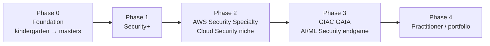

# 🍉 CyberGym

> Cybersecurity from zero, AI-Security beyond.
> A lifelong, public, owned knowledge base — my personal course on cybersecurity, written as I learn it.

---

## Who this is for

Mostly **me**. Hi, I'm **Ashraful** (handle: *Trupples*). I'm a working data scientist / ML engineer in Sydney, pivoting into cybersecurity — specifically **Cloud Security first**, then **AI/ML Security** as the long-term endgame.

But also for **you**, if you happen to land here:

- Anyone with no computer-science background who wants to actually understand how a machine works before learning to defend it
- Anyone who's been told "just go read the OSI model" and felt patronised
- Anyone curious about where AI security goes from here

Notes are written at *street-smart adult, non-CSE-background* level. Every term gets defined the first time it appears. Analogies first, technical detail second. No theory walls. No condescension. **Built like a layered cake, not a tower.**

---

## How this vault is built — the layered-cake model

Most cyber-curricula make you go *deep* on one topic before touching the next. By the time you finish 12 weeks on hardware, you've forgotten why you started. Boring, and you can't see the whole picture.

This vault uses a **spiral curriculum**: you visit the same six topic areas at growing depth, in four phases. Like building a 100-story building — you put up the skeleton across all 100 floors before you pour a single bag of cement.

The same six topic areas show up in every phase, getting deeper each time:

1. **Machine** — hardware, boot, virtualization, GPU
2. **OS** — Windows, Linux, containers, runtimes
3. **Networking** — LAN → cloud → ML traffic
4. **Security** — vocabulary → defender practitioner → AI threat modelling
5. **Cloud** — intro → AWS hands-on → security specialty → AI workload security
6. **AI/ML Security** — vocabulary → OWASP LLM Top 10 → labs → GAIA-level

> [!info] Depth ceiling
> We stop at *"I can confidently explain this to a junior on a security team and use it in an investigation."* That's working-defender depth. We do NOT go transistor physics, branch prediction internals, or ML research-paper depth. Those are research careers, not what gets you hired in cloud/AI security.

---

## Where to start reading

- **[[00-Course-Map]]** — the whole curriculum as a tree. Your map.
- **[[phase-0-foundation/00-orientation/00-welcome|Welcome]]** — the very first note. Start here if you're starting from zero.
- **[[phase-0-foundation/01-physical-machine/00-what-is-a-computer|What is a computer, really?]]** — first real lesson.

---

## Status

- **Current phase:** 0 (Foundation)
- **Currently writing:** Chapter 0.0 (Orientation) and Chapter 0.1 (Physical Machine), deep
- **Stub-only chapters:** 0.2 through 0.7 — content arriving as I learn
- **Started:** 2026-04-30
- **Vault rebuild:** 2026-04-30 (full reset, hardware-first rebuild)

---

## How notes work here

Every note is a **living document**. I read it, edit it, rewrite the parts I didn't understand, add things I want to remember. If a note feels rough, that's because it's *v0.1* — it'll be better next pass. The whole point of the spiral is that I revisit each topic at deeper levels later.

Want to follow along? Bookmark this page. Or open the [[00-Course-Map|course map]] and pick wherever you want to dive in.

---

*Ashraful (Trupples) — Sydney, Australia. Built with Obsidian, Quartz, and stubbornness.*
