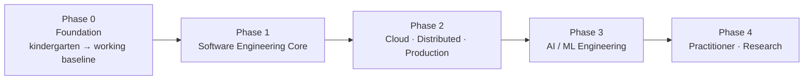

# 🍉 _thewozniakfile

> *From transistors to transformers — computer science for life.*
> A public, lifelong curriculum for software engineering, hardware, and AI, written from the ground up.

---

## What this is

`_thewozniakfile` is a public knowledge base structured as a **lifelong personal curriculum** for computer science, with a deliberate tilt toward **software engineering, hardware, and AI** — the three pillars of how computing actually gets built and shipped.

It is named after **Steve Wozniak** — the engineer who designed the Apple I single-handedly, who understood the entire stack from transistor to operating system to elegant code, and who believed real engineers should be able to walk every floor of the building they're working in. That's the spirit here.

It is not a journal. It is not a tutorial collection. It is a **course** — structured into phases, with numbered chapters and lessons, each one written to take a reader from no prior knowledge to working understanding.

Every note is written in plain English at the level of a curious, smart adult who hasn't necessarily done a CS degree. Every term is defined the first time it appears. Analogies first, technical detail second. No theory walls. No condescension.

## Who this is for

- Anyone who wants to actually understand how computers work, not just how to use a framework
- Anyone who has been told "just learn React" and felt the floor was missing
- Anyone curious about how software, hardware, and AI fit together as one system
- Anyone aiming for senior/staff-level engineering depth, or research-track AI work

## How the vault is built — the spiral curriculum

Most CS curricula go *deep* on one topic before touching the next. By the time the reader finishes 12 weeks on hardware, they've forgotten why they started.

`_thewozniakfile` uses a **spiral curriculum** instead — topic areas visited at growing depth across phases, with new topics joining at the right phase rather than forced into every level. Like building a 100-story building: skeleton across all floors first, then cement on the floors that need it.

The topic areas that show up across the spiral:

1. **Machine** — hardware, boot, memory, storage, GPU, the silicon up
2. **OS** — Linux, Windows, the kernel, processes, containers
3. **Networking** — packets to the web to distributed systems
4. **Languages + Paradigms** — Python deep, JS/TS, C, Bash, SQL; OOP, FP, design patterns
5. **Cloud + DevOps + Distributed** — AWS, Docker, Kubernetes, CI/CD, system design at scale
6. **AI / ML Engineering** — practical ML, deep learning, transformers, LLM apps, MLOps, agents

Topics don't repeat in every phase — they show up where they belong. Networking lives heavy in Phase 0 and Phase 2; hardware lives heavy in Phase 0 and re-emerges in Phase 3 (GPUs for ML); AI threads through every phase as literacy, then becomes the focus of Phase 3.

> [!info] Depth ceiling
> Each topic stops at *"a working senior engineer can explain this and use it on the job."* That is working-engineer depth. The vault does **not** descend into research-paper internals or transistor physics — those are research careers, not what most people are hired to do.

---

## Where to start reading

- **[[00-Course-Map]]** — the whole curriculum as a tree. The map.
- **[[phase-0-foundation/00-orientation/00-welcome|Welcome]]** — the very first note. Start here from zero.
- **[[phase-0-foundation/01-physical-machine/00-what-is-a-computer|What is a computer, really?]]** — first real lesson.

---

## Status

- **Current phase:** 0 (Foundation)
- **Currently writing:** Chapter 0.0 (Orientation) and Chapter 0.1 (Physical Machine)
- **Stub-only chapters:** later chapters arrive as the curriculum is built out
- **Started:** 2026-04-30 (as CyberGym) · **Pivoted to `_thewozniakfile`:** 2026-05-10

---

## How notes work

Every note here is a **living document**. It will be re-read, edited, rewritten in places it didn't quite land, expanded where deeper detail is wanted. If a note feels rough, that is because it is *v0.1* — it will be sharper next pass. The whole point of the spiral is that each topic is revisited at a deeper level later.

To follow along: bookmark this page, or open the [[00-Course-Map|course map]] and dive in wherever interests you.

---

*Built with Obsidian, Quartz v4, and a Wozniak-shaped stubbornness about understanding the whole stack.*
