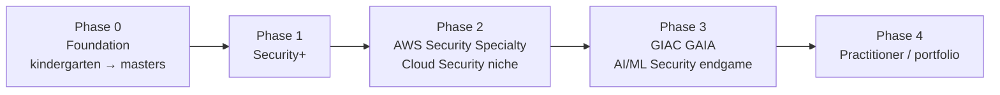

# 🍉 CyberGym

> Cybersecurity from zero, AI-Security beyond.
> A public, lifelong cybersecurity curriculum, written from the ground up.

---

## What this is

CyberGym is a public knowledge base structured as a **lifelong personal curriculum** for cybersecurity, with a particular focus on the **Cloud Security and AI/ML Security** crossover.

It is not a journal. It is not a tutorial collection. It is a **course** — structured into phases, with numbered chapters and lessons, each one written to take a reader from no prior knowledge to working understanding.

Every note is written in plain English at street-smart adult, non-CSE level. Every term is defined the first time it appears. Analogies first, technical detail second. No theory walls. No condescension.

## Who this is for

- Anyone with no computer-science background who wants to understand how a machine works before learning to defend it
- Anyone who has been told "just read the OSI model" and felt patronised
- Anyone curious about where AI security goes from here

## How the vault is built — the layered-cake model

Most cybersecurity curricula go *deep* on one topic before touching the next. By the time the reader finishes 12 weeks on hardware, they have forgotten why they started.

CyberGym uses a **spiral curriculum** instead — six topic areas visited at growing depth across four phases. Like building a 100-story building: the skeleton goes up across all 100 floors before a single bag of cement is poured.

The same six topic areas appear in every phase, getting deeper each time:

1. **Machine** — hardware, boot, virtualization, GPU
2. **OS** — Windows, Linux, containers, runtimes
3. **Networking** — LAN → cloud → ML traffic
4. **Security** — vocabulary → defender practitioner → AI threat modelling
5. **Cloud** — intro → AWS hands-on → security specialty → AI workload security
6. **AI/ML Security** — vocabulary → OWASP LLM Top 10 → labs → GAIA-level

> [!info] Depth ceiling
> Each topic stops at *"a working defender on a security team can explain this and use it in an investigation."* That is working-defender depth. The vault does **not** descend into transistor physics, branch-prediction internals, or research-paper depth — those are research careers, not what gets people hired in cloud and AI security.

---

## Where to start reading

- **[[00-Course-Map]]** — the whole curriculum as a tree. The map.
- **[[phase-0-foundation/00-orientation/00-welcome|Welcome]]** — the very first note. Start here from zero.
- **[[phase-0-foundation/01-physical-machine/00-what-is-a-computer|What is a computer, really?]]** — first real lesson.

---

## Status

- **Current phase:** 0 (Foundation)
- **Currently writing:** Chapter 0.0 (Start Here) and Chapter 0.1 (Physical Machine)
- **Stub-only chapters:** 0.2 through 0.7 — content arrives as the curriculum is built out
- **Started:** 2026-04-30

---

## How notes work

Every note here is a **living document**. It will be re-read, edited, rewritten in places it didn't quite land, expanded where deeper detail is wanted. If a note feels rough, that is because it is *v0.1* — it will be sharper next pass. The whole point of the spiral is that each topic is revisited at a deeper level later.

To follow along: bookmark this page, or open the [[00-Course-Map|course map]] and dive in wherever interests you.

---

*Built with Obsidian, Quartz v4, and stubbornness.*
