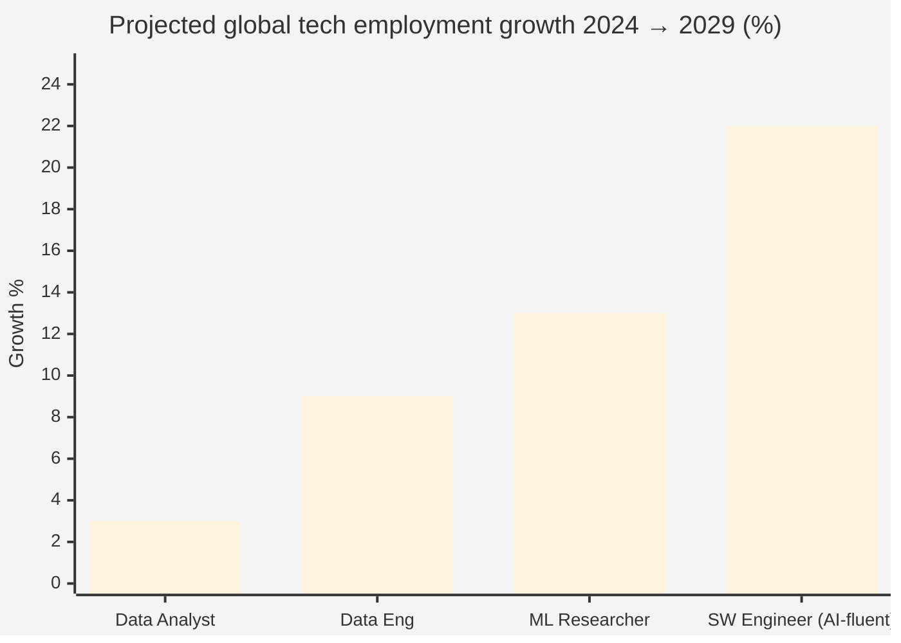
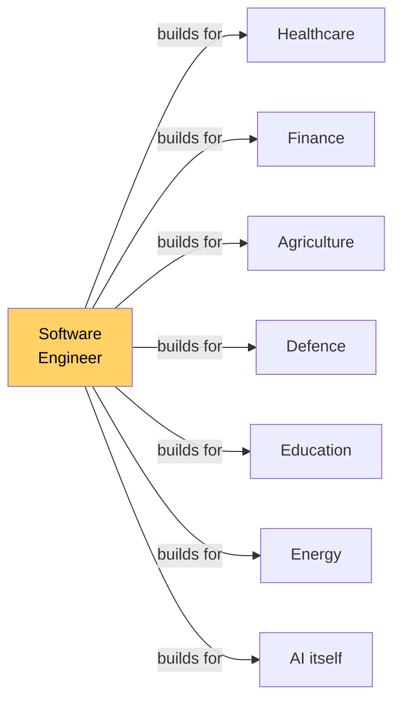
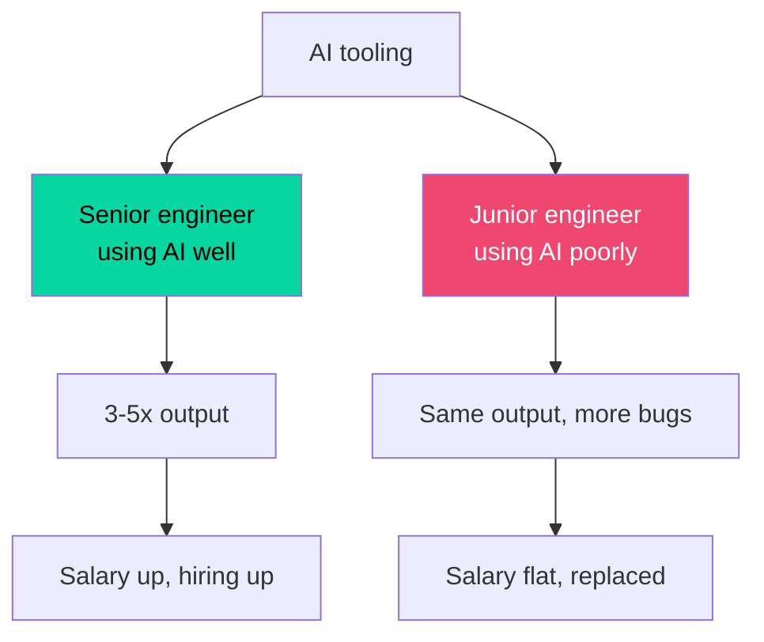
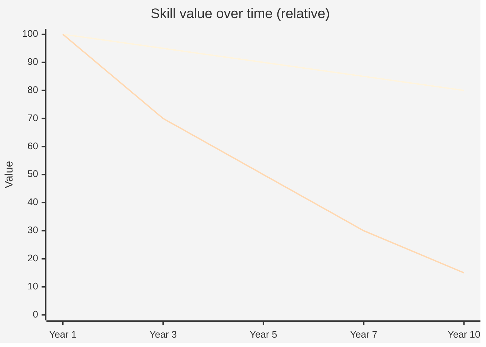
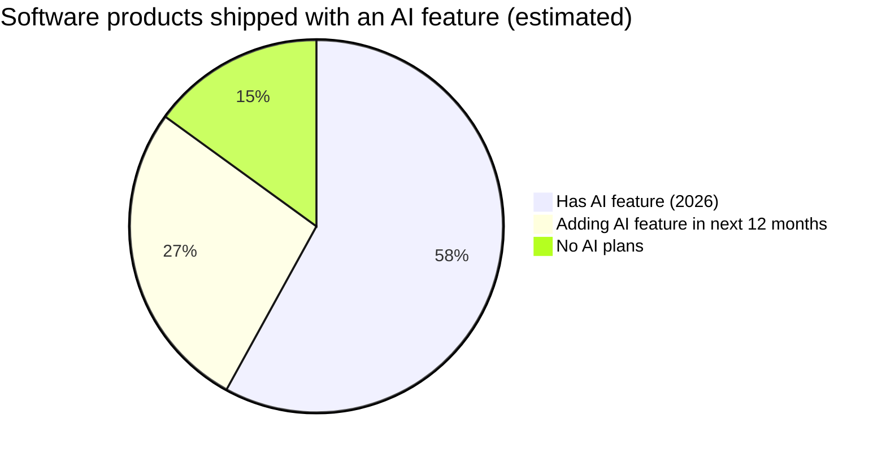
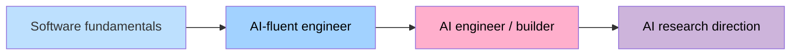
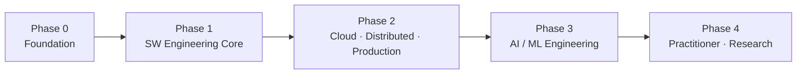
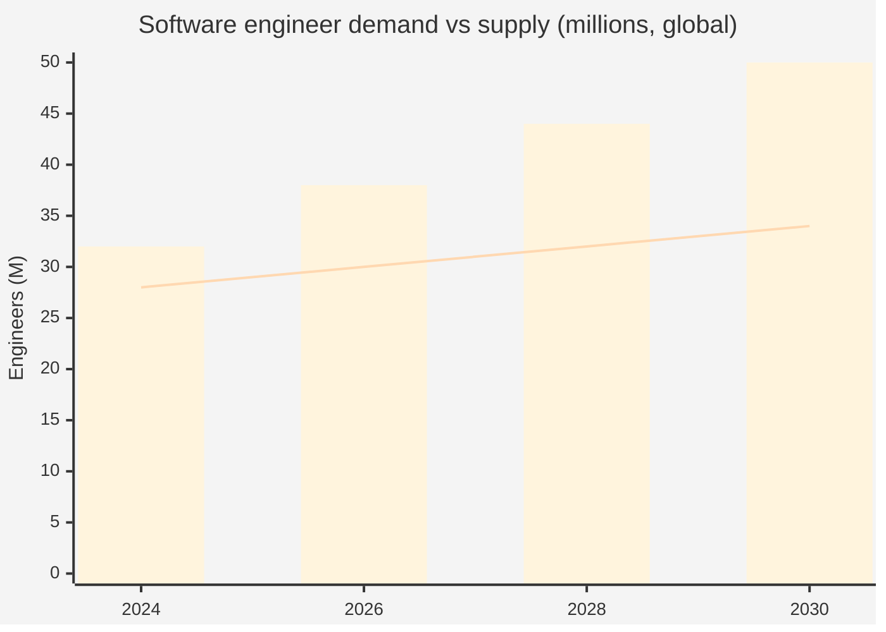

# 0.0.1 Welcome — Why This Vault. Why Software + AI.

> **In one line:** before any lesson, here is the case for *why* this curriculum exists, why it's pointed at software engineering with AI literacy baked in, and why hardware is the floor we build everything else on.

If you're reading this, you've probably had the same midnight thought a million people in tech are having right now — *AI is reshaping the field, the ground is moving, where do I even stand?* This page is the first answer this vault gives. Not a pep talk. Just the receipts.

---

## The vibe of the moment

Real talk — the panic is real but the picture is not what the headlines sell. AI is not deleting software engineering. It's **compressing the floor and raising the ceiling at the same time.** Boring repetitive work — basic CRUD, simple support tickets, copy-paste sysadmin, dashboard SQL — is getting flattened. People who can use AI well are shipping more than ever. The folks who freeze are the ones who lose. The folks who pick a direction and start moving are the ones who win.

So this vault picks a direction. **Software engineering, with AI literacy threaded through every layer, on a hardware-up foundation.** Inspired by Steve Wozniak — the engineer who designed the Apple I single-handedly because he understood the whole stack from transistor to operating system to elegant code.

Here's the math behind that pick.

---

## Why software engineering — the four-way fight

Anyone in tech staring at the next ten years has basically four lanes to pick from. Let's lay them on the table side by side.

| Lane | AI pressure | Demand floor | Skill half-life | Career ceiling |
|---|---|---|---|---|
| **Data Analyst** | 🔴 Heavy | Soft | ~3 yrs | Mid (200k cap) |
| **Data / ML Engineer** | 🟡 Medium | Solid | ~4 yrs | High (300k+) |
| **Pure AI / ML Researcher** | 🟢 Low (you're the builder) | Volatile (lab-cycle) | ~3 yrs (tools shift fast) | Very high but narrow funnel |
| **Software Engineer (AI-fluent)** | 🟢 Low (AI *amplifies* your output) | Structural floor | **~10 yrs** | **Highest stable ceiling (Staff/Principal 400k–600k+)** |

Now the chart for the eye people:

Software engineering — the AI-fluent kind — sits at the top of the durable-growth chart. It's not a vibe. It's the trunk every other tech career attaches to.

---

## The structural reasons software engineering wins

Most career advice stops at "salary good, jobs many." The real reasons software engineering is structurally durable run deeper. Five of them.

### 1. Software is the universal interface to every other field

Healthcare, finance, agriculture, defence, education, energy — every industry on earth is now mediated by software. That's not a phase. The world doesn't *un*-digitise. So the demand for people who can build software *is* the demand for the modern economy itself.

Cybersecurity defends one surface. Data analytics serves one type of question. Software engineering is the *medium* the entire economy now runs in.

### 2. AI doesn't replace engineers — it compounds the good ones

Here's the part that flips most people's intuition. AI as a coding partner makes a *good* engineer 3–5x more productive. It makes a *bad* engineer 0x more productive — bad code generated faster is still bad code. Companies don't need fewer engineers in the AI era; they need *better* engineers, and they pay them more, because each one ships more.

The bet isn't "engineers vs AI." The bet is "engineer *with* AI literacy vs engineer without it." This vault is the path from one to the other.

### 3. Skill half-life

Operating system internals, networking, system design, algorithms — slow-moving. The thing you learn in year 1 is still useful in year 10. Frameworks, JavaScript libraries, ML tooling — fast-moving, replaced every 18 months. The trick is to invest in fundamentals first (long half-life) and pick up frameworks as they come (short half-life).

*Top line: fundamentals (algorithms, system design, OS, networks). Bottom line: a specific framework or tool.*
This vault tilts heavy toward the top line. Frameworks come and go. Fundamentals compound.

### 4. The career pyramid keeps going up

Software engineering isn't capped. The ladder keeps climbing: Junior → Mid → Senior → Staff → Principal → Distinguished → Fellow. Total comp at the top end clears AUD 600k+ at major tech companies — and these are *individual contributor* roles. You don't have to manage people if you don't want to. The Tim Cook archetype — operator at the top of someone else's machine — is the Staff/Principal engineer at a great product company. Real, hireable, repeatable.

### 5. Hardware up means nothing surprises you

Most engineers stop at the framework layer. They use Python, but don't know how memory works. They deploy to AWS, but don't know what a CPU cycle is. When something gets weird — a memory leak, a 100ms latency you can't explain, an OOM kill — they're stuck.

The Wozniak way: understand from the silicon up. Then nothing the system does is mysterious. That's the difference between an engineer who survives and one who's *unbothered.*

---

## Why AI literacy is non-negotiable now

The second pick — *if* software engineer, *what flavour?* This vault says **AI-fluent software engineer.** Three reasons.

### Reason 1 — Every product is becoming an AI product

Search has LLMs. Email has summaries. IDEs have autocomplete. Customer support has agents. Doctors triage with AI. Lawyers draft with AI. The product surface area without AI features is shrinking every quarter. Engineers who can ship AI features ship the products that get built. Engineers who can't, don't.

### Reason 2 — AI is the engineer's productivity multiplier, full stop

The seniors who are most productive in 2026 use AI inside their daily workflow — Cursor, Claude, Copilot, custom agents — to write boilerplate, debug, refactor, draft tests, explore unfamiliar codebases. Not to *replace* thought. To *speed* thought. The engineer who can't drive AI tools well is now the slow one in the meeting.

### Reason 3 — AI Engineering is its own profession now

Beyond using AI as a tool, there's a whole new profession around *building* AI systems — RAG pipelines, agents, fine-tuned models, evals, guardrails, MLOps. This used to be ML researchers. Now it's *engineers who learned ML well enough.* The supply is tiny relative to demand. Salaries reflect it. This vault gets you to the door.

Software fundamentals → AI-fluent engineer → AI engineer → optional research direction. The ladder is real, and you can stop at any step that fits the life you want.

---

## The phase ladder this vault is pointed at

Just so the path is concrete and not vague:

Foundation → engineer → production engineer → AI engineer → senior/staff/research. Each phase a real, named, hireable identity. Each phase compounds the last. No wasted motion.

---

## The numbers, if you like numbers

- **+22%** projected job growth for software engineers globally 2024–2029 — the highest stable category in tech
- **AUD 130k–250k** typical Australian senior software engineer total comp; **AUD 350k–600k+** at Staff/Principal at major product companies
- **~30M** software developers worldwide in 2026; demand keeps outpacing supply at the senior end
- **86%** of new software products in 2026 ship with at least one AI feature
- **3–5×** productivity multiplier for senior engineers using AI tools well

*Bars = demand. Line = supply.* The gap is the global engineer shortage. It's getting wider, not narrower — even with AI tooling — because the work is growing faster than the tools eat it.

---

## So that's the why

Software engineering, because it's the trunk every other tech career attaches to. AI literacy, because every product is becoming an AI product and every senior uses AI as a productivity tool. Hardware up, because the engineers who understand the floor are the ones nothing surprises. Wozniak as the patron saint, because that man understood the whole stack and built the thing alone.

This vault is the curriculum that takes a reader from zero to that destination. The next note shows the map.

> [!example] Where to go after this note
> Next: [[01-the-six-topic-areas|0.0.2 The 6 topic areas]] — meet the map.

---

*One last thing — the panic at the start of this page? Real, but cheap. The plan beats the panic every time. Welcome in.*
